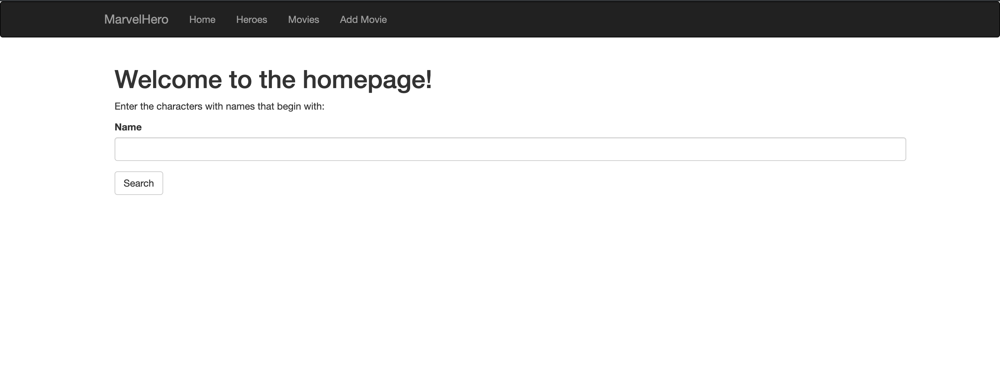
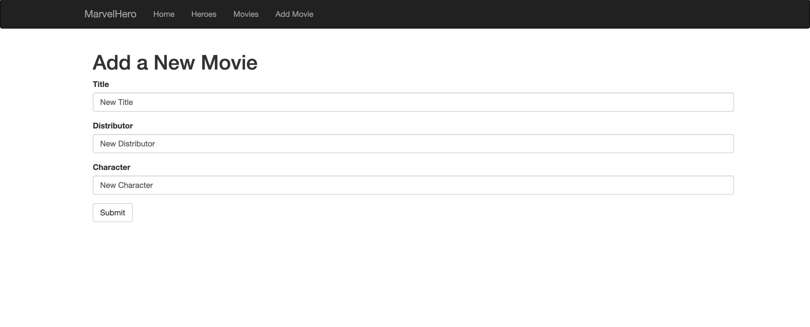

# SI 507 Final Project: Marvel database

Roy Fa-Lin Wang

[Link to this repository](https://github.com/falinwang/SI507_FinalProject)

---

## Project Description

This project is about using movie database and Marvel superheroes API to introduce the information and image of superheroes by searching and sorting.

## How to run

1. First, you should install all requirements with `pip install -r requirements.txt`
2. Second, you should run `python SI507_finalProject.py runserver`.
3. Then open your browser and enter localhost 5000.

## How to use

1. Enter some keywords about the name of the character in the searching box to search the superheroes.

2. The result will show you related hero's name, description and wiki link and the picture of the hero.
3. Add a new movie by entering title, distributor and character.

## Routes in this application
- `/` -> This is the home page. This page will show the upcoming Marvel movies and have a search tool for superheroes.
- `/all_superhero` -> This page will show the total numbers of superheroes.
- `/superhero/<hero_name>` -> This page will show the introduction of superheroes.
- `/all_movie` -> This page will show the total numbers of movies.
- `add_movie` -> This page will allow user to add a new movie.
- `/movie/<movie_name>` -> This page will show the introduction of movies.

## How to run tests
1. First you should run `python SI507project_tests.py runserver`
2. Check terminal to see if the test is working.

## In this repository:
- SI507project_tools.py
- SI507project_tests.py
- SI507_finalProject.py
- requirements.txt
- Database_Diagram.png
- templates
  - base.html
  - index.html
  - 404.html
  - add_movie.html
  - all_movie.html
  - all_superhero.html
  - superhero.html
- static
  - favicon.ico
- marvel_cache.json (Example)
- all_superhero.csv (Example)
- superhero.db (Example)

---
## Code Requirements for Grading
Please check the requirements you have accomplished in your code as demonstrated.
- [ ] This is a completed requirement.
- [x] This is an incomplete requirement.

Below is a list of the requirements listed in the rubric for you to copy and paste.  See rubric on Canvas for more details.

### General
- [x] Project is submitted as a Github repository
- [x] Project includes a working Flask application that runs locally on a computer
- [x] Project includes at least 1 test suite file with reasonable tests in it.
- [x] Includes a `requirements.txt` file containing all required modules to run program
- [x] Includes a clear and readable README.md that follows this template
- [x] Includes a sample .sqlite/.db file
- [x] Includes a diagram of your database schema
- [x] Includes EVERY file needed in order to run the project
- [ ] Includes screenshots and/or clear descriptions of what your project should look like when it is working

### Flask Application
- [x] Includes at least 3 different routes
- [x] View/s a user can see when the application runs that are understandable/legible for someone who has NOT taken this course
- [x] Interactions with a database that has at least 2 tables
- [x] At least 1 relationship between 2 tables in database
- [x] Information stored in the database is viewed or interacted with in some way

### Additional Components (at least 6 required)
- [x] Use of a new module
- [x] Use of a second new module
- [ ] Object definitions using inheritance (indicate if this counts for 2 or 3 of the six requirements in a parenthetical)
- [ ] A many-to-many relationship in your database structure
- [x] At least one form in your Flask application
- [x] Templating in your Flask application
- [x] Inclusion of JavaScript files in the application
- [x] Links in the views of Flask application page/s
- [ ] Relevant use of `itertools` and/or `collections`
- [ ] Sourcing of data using web scraping
- [x] Sourcing of data using web REST API requests
- [x] Sourcing of data using user input and/or a downloaded .csv or .json dataset
- [x] Caching of data you continually retrieve from the internet in some way

### Submission
- [x] I included a link to my GitHub repository with the correct permissions on Canvas! (Did you though? Did you actually? Are you sure you didn't forget?)
- [x] I included a summary of my project and how I thought it went **in my Canvas submission**!
